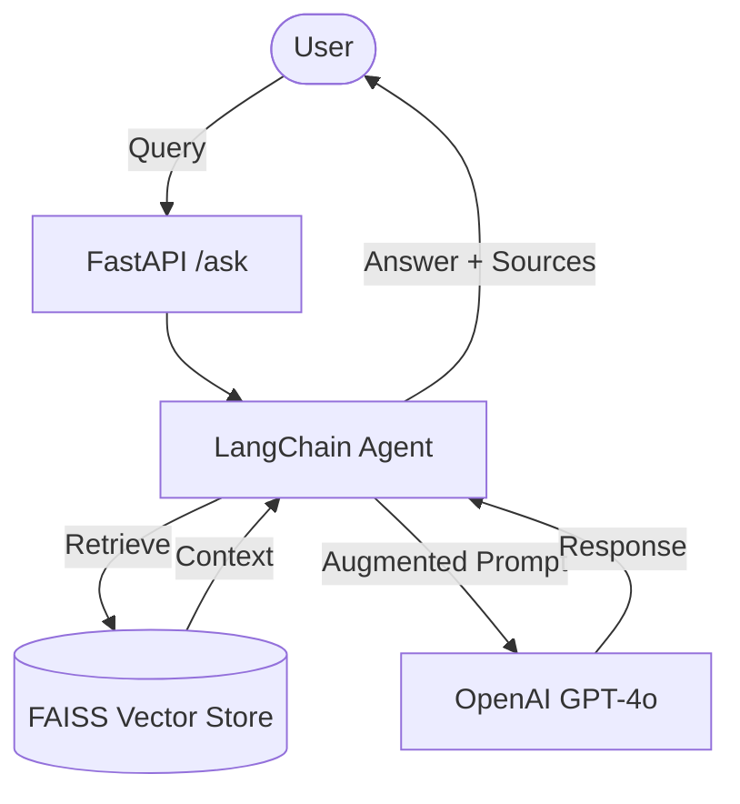

# AI Engineer Assignment – First500Days

A Retrieval-Augmented Generation (RAG) system for querying internal company policy documents. This project implements a conversational agent and a FastAPI backend to provide precise answers based on indexed PDF documents.

## 🏗️ Architecture Overview

The system follows a standard RAG pipeline enhanced with LangGraph for agentic reasoning.



1.  **Ingestion**: PDF documents are loaded from `document_for_rag/`, split into chunks, and indexed using FAISS.
2.  **Retrieval**: The agent uses a similarity search to fetch relevant context from the FAISS index.
3.  **Generation**: The LLM generates a response using the retrieved context and user query.
4.  **API**: A FastAPI endpoint exposes the RAG agent for integration.

---

## 🛠️ Tech Stack

-   **Core Framework**: [LangChain](https://www.langchain.com/) & [LangGraph](https://langchain-ai.github.io/langgraph/)
-   **LLM**: OpenAI GPT-4o / GPT-4o-mini
-   **Vector Store**: [FAISS](https://github.com/facebookresearch/faiss) (CPU-based)
-   **Backend**: [FastAPI](https://fastapi.tiangolo.com/) + [Uvicorn](https://www.uvicorn.org/)
-   **PDF Processing**: PyPDF
-   **Embeddings**: OpenAI `text-embedding-3-large`

---

## 🚀 Setup Instructions

### 💻 Local Development

1.  **Clone the Repository**:
    ```bash
    git clone <repository-url>
    cd Assignment_first500days
    ```

2.  **Create Virtual Environment**:
    ```bash
    python -m venv venv
    .\venv\Scripts\activate
    ```

3.  **Install Dependencies**:
    ```bash
    pip install -r requirements.txt
    ```

4.  **Configure Environment**:
    Create a `.env` file in the root directory (or use the existing one):
    ```env
    OPENAI_API_KEY=your_openai_api_key_here
    ```

5.  **Run Tasks**:
    - **Task 1 (Simple Agent)**: `python task1.py`
    - **Task 2 (RAG Agent)**: `python task2.py`
    - **Task 3 (FastAPI Server)**: `uvicorn task3:app --reload`

### ☁️ Azure Deployment (Azure App Service)

1.  **Prepare for Deployment**:
    Ensure `requirements.txt` and `task3.py` are in the root.
2.  **Create Azure App Service**:
    - Choose **Python 3.10+** environment.
    - Set the **Startup Command**: `uvicorn task3:app --host 0.0.0.0 --port 8000`.
3.  **Environment Variables**:
    - Go to **Configuration** > **Application Settings**.
    - Add `OPENAI_API_KEY`.
4.  **Deploy**:
    Deploy via GitHub Actions or Local Git using Azure CLI.

---

## 🧠 Design Decisions

-   **FAISS for Vector Search**: Chosen for its high performance and ease of local setup without requiring a separate database server.
-   **LangGraph for Agents**: Used to manage complex state and tool-calling transitions more robustly than standard LangChain agents.
-   **RecursiveCharacterTextSplitter**: Used with a 200-character chunk size and 30-character overlap to balance context granularity and LLM token limits.
-   **FastAPI**: Selected for its asynchronous capabilities, automatic Swagger documentation (`/docs`), and high performance.

---

## ⚠️ Limitations & Future Improvements

### Current Limitations
-   **In-Memory Storage**: Vector store is recreated on every run (in `task2.py`).
-   **Local PDF Directory**: Requires files to be present in a local folder.
-   **Basic RAG**: Currently uses standard similarity search without reranking.

### Future Improvements
-   **Persistent DB**: Migrate to Pinecone, Weaviate, or ChromaDB for persistent storage.
-   **Advanced RAG**: Implement Hybrid Search (Keyword + Semantic) and Re-ranking for better accuracy.
-   **Document Ingestion Pipeline**: Add an endpoint to upload and process new PDFs dynamically.
-   **Authentication**: Add JWT-based security to the FastAPI endpoints.
